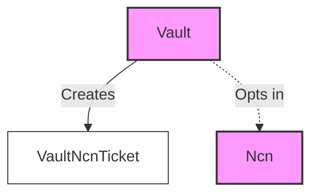
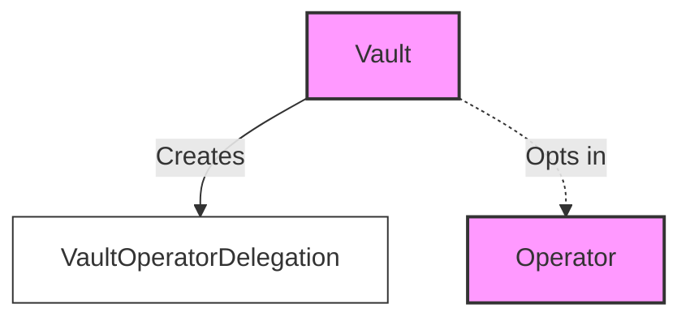
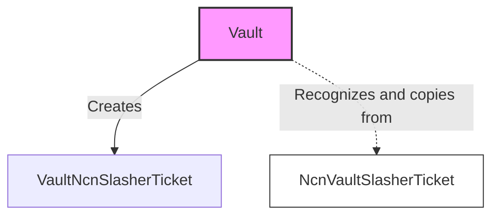
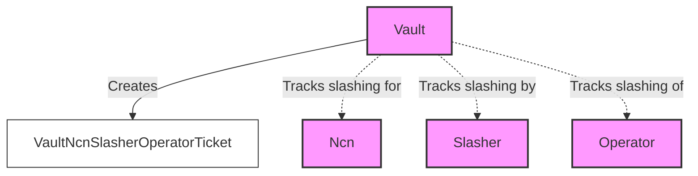

## 1. About the program

The vault program manages the vault receipt tokens (VRTs) and associated deposits. The program stores deposited funds and handles the minting and burning of tokenized stake. It also manages the vault's stake in an NCN, including delegation and slashing.

## 2. Diagram

## 3. Accounts

All accounts for the vault program are defined in the [jito-vault-core](https://github.com/jito-foundation/restaking/tree/master/vault_core/src) crate.

More information about the theory of operation can be found in the [theory of operation](./theory_of_operation.md) section.

### 3.1. Config

The configuration account is a global account that is used to configure the vault program. It is used to set the restaking program and other program-wide settings. It also keeps track of the number of vaults, fee caps, and other program-wide settings. The number of vaults is used to programs can programmatically iterate through all vaults in the program.

### 3.2. Vault

The Vault account is a central component of the vault program, responsible for managing token deposits, VRT minting and burning, and delegation states. It contains several administrative pubkeys and other vault-wide settings.

### 3.3. VaultNcnTicket

- VaultNcnTicket is created by the vault to signify support (or lack of) for a given NCN.
- VaultNcnTicket is activated through a warmup process.
- VaultNcnTicket is deactivated through a cooldown process.
- VaultNcnTicket is used to track the state of the vault's support for a given NCN.
- Only the Vault ncn_admin pubkey can modify the VaultNcnTicket account.

### 3.4. VaultOperatorDelegation

- VaultOperatorDelegation account is created by the vault to signify that the vault has delegated its stake to a given operator.
- Only the Vault operator_admin pubkey can create the VaultOperatorDelegation account.
- The Vault delegation_admin pubkey can modify the VaultOperatorDelegation account.
- The VaultOperatorDelegation account is used to track the state of the vault's delegation to a given operator.

### 3.5. VaultNcnSlasherTicket

- VaultNcnSlasherTicket is created by the vault to signify that the vault has opted-in to a given slasher.
- Only the Vault ncn_admin pubkey can modify the VaultNcnSlasherTicket account.
- The VaultNcnSlasherTicket account is used to track the state of the vault's opt-in to a given slasher.

### 3.6. VaultNcnSlasherOperatorTicket

- VaultNcnSlasherOperatorTicket is created by the vault to track slashings for a given vault, ncn, slasher, operator, epoch pair.

### 3.7. VaultStakerWithdrawalTicket

- VaultStakerWithdrawalTicket is created by the vault to track the withdrawal of a given staker.
- Stakers create the VaultStakerWithdrawalTicket account when they initiate a withdrawal.

### 3.8. VaultUpdateStateTracker

- VaultUpdateStateTracker is created by the vault during epoch updates to aggregate stake information of the `VaultOperatorDelegation` accounts.

## 4. Tracking State

State in these programs is spread out across many accounts.
To reason about the state of stake at any given time, one can reference the chart below.

Assets are considered staked iff:

- The NCN has opted-in to the operator
- The operator has opted-in to the NCN
- The operator has opted-in to the vault
- The vault has opted-in to the operator
- The vault has opted-in to the NCN
- The NCN has opted-in to the vault
- The Vault is delegated to that operator

When assets are staked and the following conditions are met, the vault can be slashed by a given slasher:

- The NCN has opted in to a slasher for the given vault.
- The vault has agreed to the conditions set by the NCN for slashing the vault.

