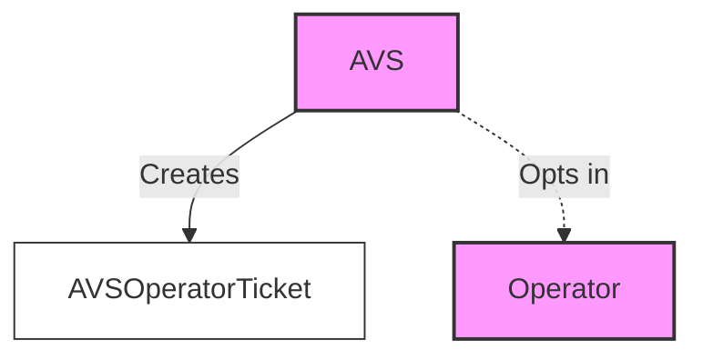

# Architecture

### Relationships

#### Operator <> AVS Opt In

```mermaid
graph TD
    classDef main fill: #f9f, stroke: #333, stroke-width: 2px;
    classDef ticket fill: #fff, stroke: #333, stroke-width: 1px;
    AVS[AVS]:::main
    Operator[Operator]:::main
    AvsOperatorTicket[AVSOperatorTicket]:::ticket
    AVS -->|Creates| AvsOperatorTicket
    AVS -.->|Opts in| Operator
```