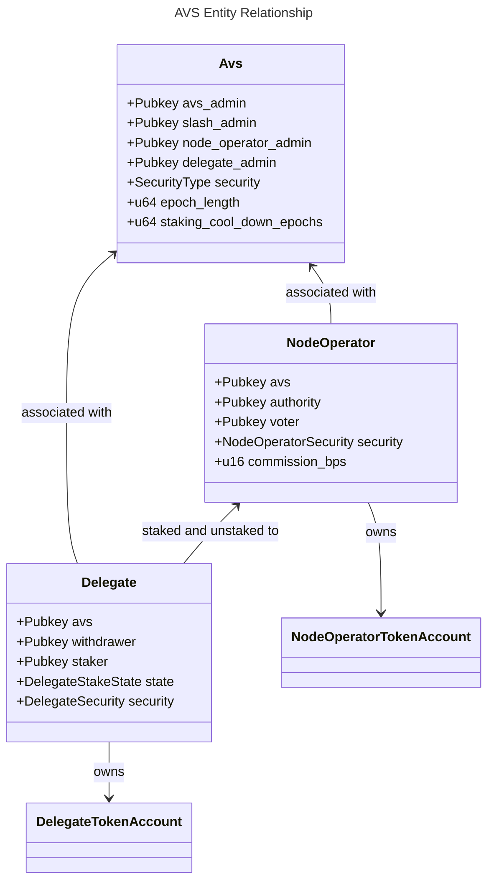

# Architecture

```mermaid
---
title: AVS Entity Relationship
---
classDiagram
    class Avs {
        +Pubkey avs_admin
        +Pubkey slash_admin
        +Pubkey node_operator_admin
        +Pubkey delegate_admin
        +SecurityType security
        +u64 epoch_length
        +u64 staking_cool_down_epochs
    }

    class NodeOperator {
        +Pubkey avs
        +Pubkey authority
        +Pubkey voter
        +NodeOperatorSecurity security
        +u16 commission_bps
    }

    class Delegate {
        +Pubkey avs
        +Pubkey withdrawer
        +Pubkey staker
        +DelegateStakeState state
        +DelegateSecurity security
    }

    Avs <-- NodeOperator: associated with
    Avs <-- Delegate: associated with
    NodeOperator <-- Delegate: staked and unstaked to
    NodeOperator --> NodeOperatorTokenAccount: owns
    Delegate --> DelegateTokenAccount: owns
```