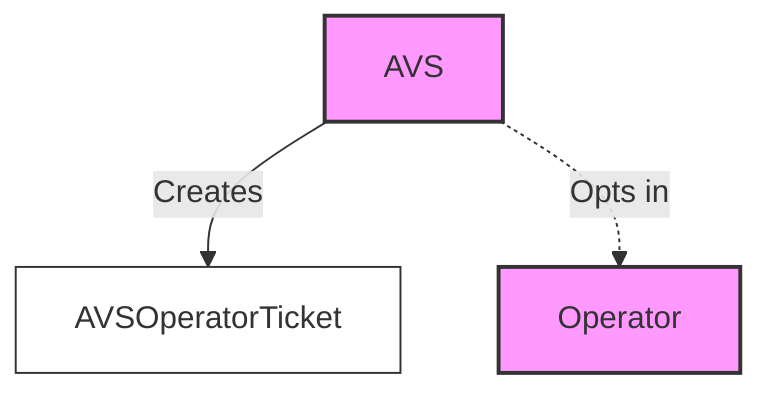
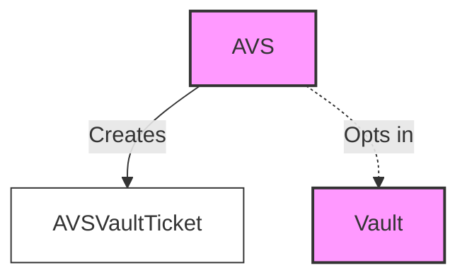
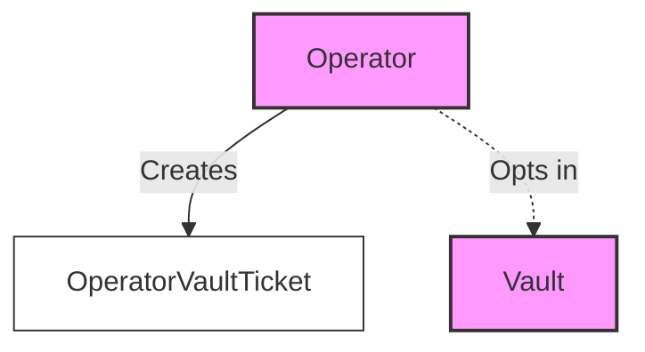

# Restaking Program

### Relationships

The restaking protocol leverages the concept of entity tickets to track relationships between AVS, operators, and vaults
on-chain. This allows for an extremely flexible opt-in and opt-out system.

#### Operator AVS Ticket

This ticket represents the relationship from the Operator's perspective. It is created by the Operator when it opts in
to work with an AVS.

#### Avs Operator Ticket

This ticket represents the relationship from the AVS's perspective. It is created by the AVS when it opts in to work
with an Operator.

#### AVS Vault Ticket

This ticket represents the relationship between an AVS and a Vault. It is created by both the AVS and the Vault when
they opt in to work with each other.

#### Operator Vault Ticket

This ticket represents the relationship between an Operator and a Vault. It is created by both the Operator and the
Vault when they opt in to work with each other.

#### AVS Vault Slasher Ticket

This ticket represents the slashing relationship between an AVS and a Vault. It is created by the AVS, allowing the AVS
to potentially slash the Vault under certain conditions.

