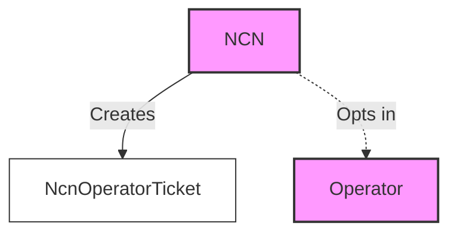
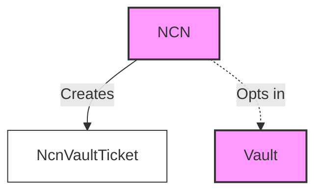
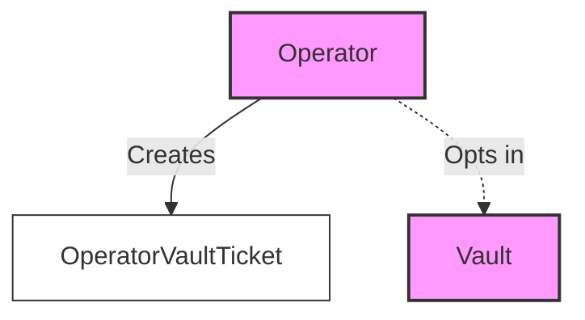
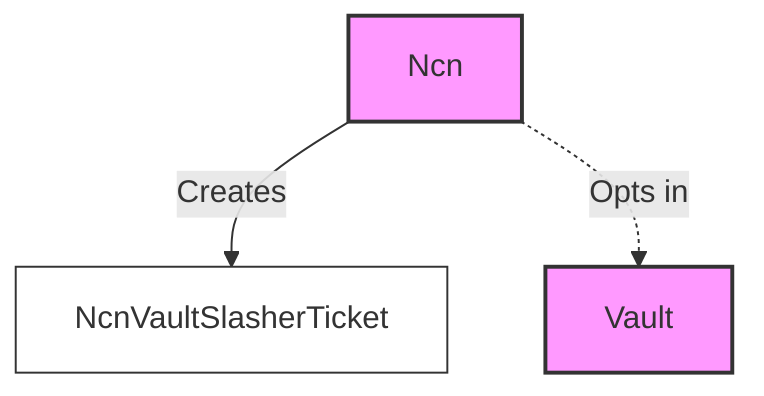

### About the program

The restaking program acts as a registry for NCNs, operators, and relationships between NCNs, operators, and vaults.

It allows users to do the following:

- Registers NCN, operators, and their configurations.
- Stores relationships between NCN, operators, and vaults.

The restaking program does not store any funds; it is purely used as a registry and relationship manager between
entities in the system.

### Node Consensus Network (NCN)

NCN are services that provide infrastructure to the network, such as validators, oracles, keepers, bridges, L2s, and
other services that require a staking mechanism for security.

NCN can be registered through the restaking program.

There are several things one can do after registering an NCN:

- Add and remove support for operators participating in the NCN operator set.
- Add and remove support for vaults
- Add and remove support for slashers
- Withdraw funds sent to the NCN from rewards, airdrops, and other sources.

### Operator

Operators are entities responsible for running NCN software.

Operators can register through the restaking program and configure several variables:

- Add and remove support for vaults
- Add and remove support for NCN
- Change voter keys
- Withdraw funds sent to the operator from rewards, airdrops, and other sources.

### Relationships

The Jito Restaking protocol requires mutual opt-in from all parties entering stake agreements: vaults, operators, and
NCNs.

It leverages the concept of entity tickets, which are PDAs representing opt-in from one party to another. These tickets
are created on-chain and can be used to track relationships between NCN, operators, and vaults. In addition to entity
information, these tickets can store additional data like slot activated/deactivated, slashing conditions, and more.

The tickets are detailed below:

#### Operator NCN Ticket

This ticket represents the relationship from the Operator's perspective. It is created by the Operator when it opts in
to work with an NCN.

#### Ncn Operator Ticket

This ticket represents the relationship from the NCN's perspective. It is created by the NCN when it opts in to work
with an Operator.

#### NCN Vault Ticket

This ticket represents the relationship between an NCN and a Vault. It is created by both the NCN and the Vault when
they opt in to work with each other.

#### Operator Vault Ticket

This ticket represents the relationship between an Operator and a Vault. It is created by both the Operator and the
Vault when they opt in to work with each other.

#### NCN Vault Slasher Ticket

This ticket represents the slashing relationship between an NCN and a Vault.

NCN register slashers, which allows the slasher to potentially slash the Vault under appropriate conditions.

