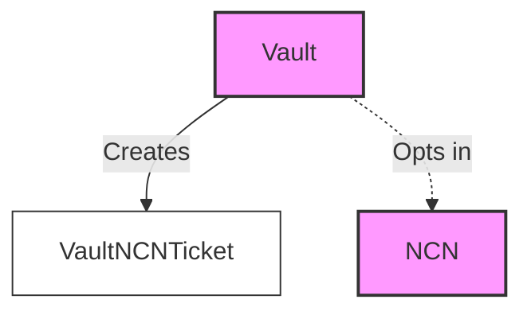
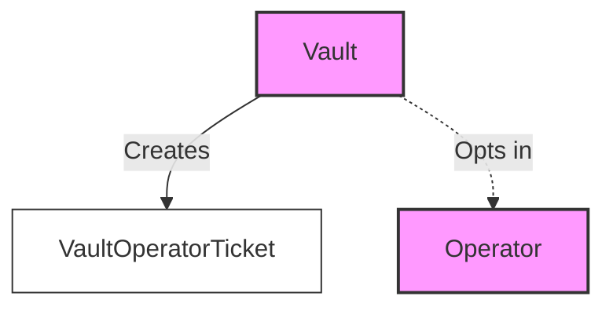
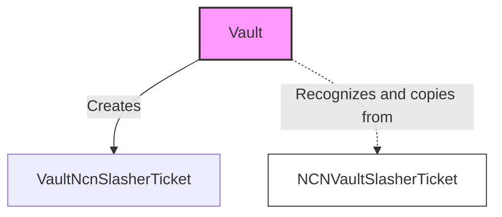
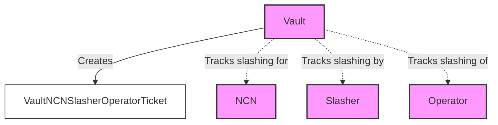
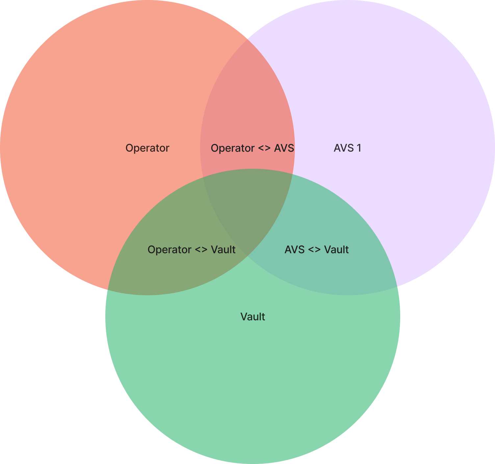

## About the program

The vault program manages the vault receipt tokens (VRTs) and associated deposits.
The program stores deposited funds and handles the minting and burning of tokenized stake.

The vault program allows users to do the following:

- Create VRTs (staked assets)
- Deposit assets and receive VRTs in return
- Burn VRTs to withdraw assets
- Manage delegations to operators
- Handle slashing events

The vault program stores user funds and is responsible for the issuance and redemption of VRTs.
Funds do not leave the program under any conditions unless they are withdrawn by the user or a slashing takes place.

## Vault

Vaults are the core entities that manage deposits, withdrawals, and LRT minting/burning.

Several operations can be performed with a vault:

- Initialize a new vault with specific parameters
- Add and remove support for operators
- Add and remove support for NCNs
- Manage delegations to operators
- Process deposits and withdrawals
- Handle slashing events

## Vault receipt token (VRT)

VRTs are a receipt token representing a user's pro-rata share of assets in the vault.
They are minted when users deposit and burned when users withdraw.

## Relationships

The vault program interacts with other entities in the Jito Restaking protocol:

- Operators: The vault delegates to operators and manages these relationships
- NCN: The vault interacts with NCN for slashing and other protocol-specific operations
- Users: Deposit assets and receive VRTs, or burn VRTs to withdraw assets

The vault program uses similar ticket structures as the restaking program to manage these relationships, ensuring mutual
opt-in from all parties involved. Those tickets include:

#### Vault NCN Ticket

#### Vault Operator Ticket

#### Vault NCN Slasher Ticket

#### Vault NCN Slasher Operator Ticket

## Delegations

The vault program manages delegations to operators. This involves:

- Adding new delegations to operators
- Removing delegations from operators
- Updating delegations at epoch boundaries

Delegations are stored in the VaultDelegationList.

## Slashing

The vault program handles slashing events, which may occur if an operator misbehaves. This includes:

- Processing slash instructions from authorized slashers
- Adjusting the vault's total assets and individual delegations
- Ensuring the integrity of the LRT exchange rate
- Respects the maximum slashing conditions set by the NCN

## Tracking State

State in these programs is spread out across many accounts.
To reason about the state of stake at any given time, one can reference the chart below.

Assets are considered staked iff:

- The NCN has opted-in to the operator
- The operator has opted-in to the NCN
- The operator has opted-in to the vault
- The vault has opted-in to the operator
- The vault has opted-in to the NCN
- The NCN has opted-in to the vault
- The Vault is delegated to that operator

When assets are staked and the following conditions are met, the vault can be slashed by a given slasher:

- The NCN has opted in to a slasher for the given vault.
- The vault has agreed to the conditions set by the NCN for slashing the vault.

