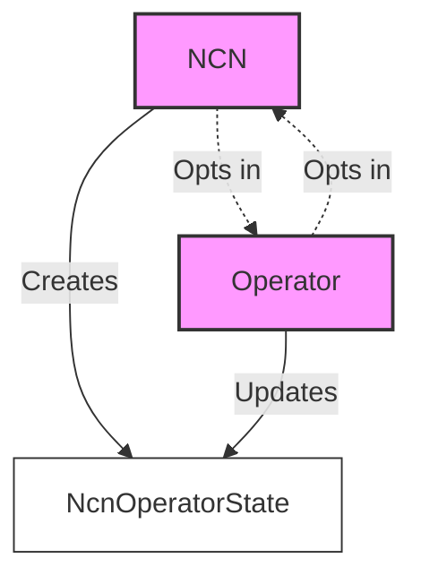
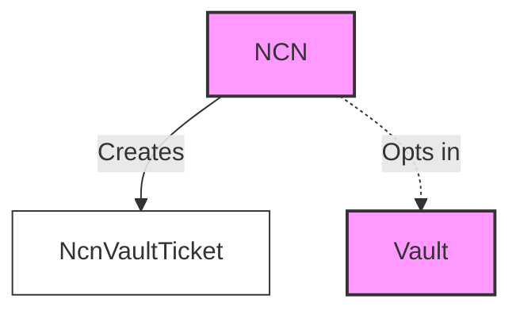
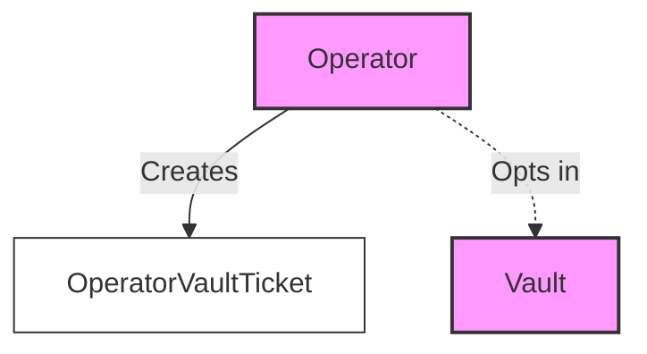
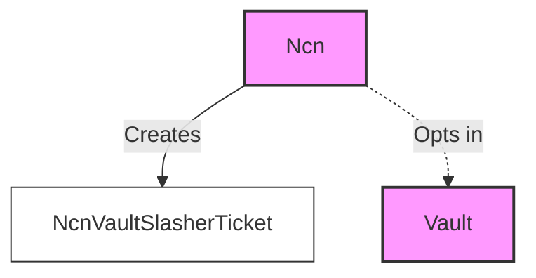

# 1. About the program

The restaking program acts as a registry for NCNs, operators, and relationships between NCNs, operators, and vaults.

The restaking program does not store any funds; it is purely used as a registry and relationship manager between
entities in the system. All of the accounts detailed below can be found in the `jito-restaking-core` crate.

# 2. Accounts

## 2.1. NCN (Node Consensus Network) Account

The NCN account stores information about a Node Consensus Network.

Key details:
- Represents services that provide infrastructure to the network (e.g., validators, oracles, keepers)
- Stores configuration data for the NCN
- Manages relationships with operators and vaults
- Tracks supported slashers

### 2.1.1. Operator Account

The Operator account stores information about entities responsible for running NCN software.

Key details:
- Stores operator configuration data
- Manages relationships with NCNs and vaults
- Stores voter keys

## 2.2. NcnOperatorState Account

This account represents the mutual opt-in relationship between an NCN and an Operator.

Key details:
- Created by the NCN
- Stores the current state of the relationship (e.g., warm-up, active, cool-down)
- The Operator `ncn_admin` can opt-in and opt-out of an NCN at any time.
- The NCN `operator_admin` can opt-in and opt-out of an Operator at any time.

## 2.3. NcnVaultTicket Account

This account represents the relationship between an NCN and a Vault.

Key details:
- Created by the NCN
- Indicates the NCN's opt-in to work with a specific Vault
- The NCN `vault_admin` can opt-in and opt-out of a Vault at any time.

## 2.4. OperatorVaultTicket Account

This account represents the relationship between an Operator and a Vault.

Key details:
- Created by the Operator
- Indicates the Operator's opt-in to work with a specific Vault
- The Operator `vault_admin` can opt-in and opt-out of a Vault at any time.

## 2.5. NCNVaultSlasherTicket Account

This account represents the slashing relationship between an NCN and a Vault.

Key details:
- Created by the NCN
- Allows registered slashers to potentially slash the Vault under appropriate conditions
- The NCN `slasher_admin` can opt-in and opt-out of a Vault at any time.

