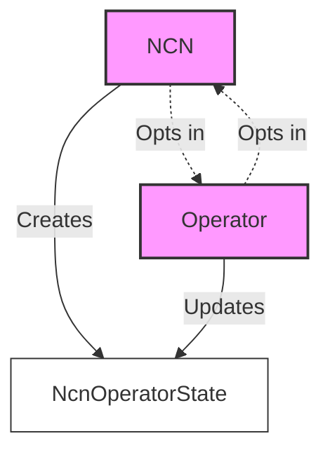
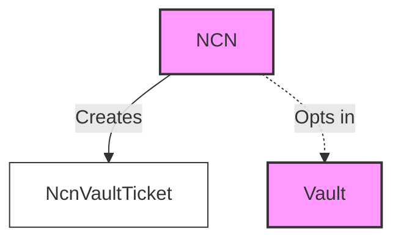
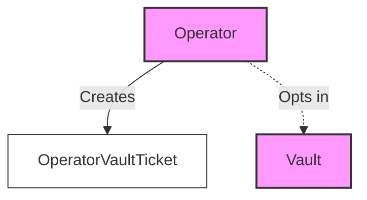
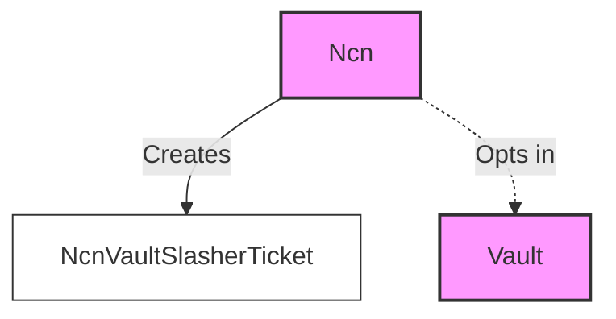

## 1. About the program

The restaking program acts as a registry for NCNs, operators, and relationships between NCNs, operators, and vaults.

It allows users to do the following:

- Registers NCN, operators, and their configurations.
- Stores relationships between NCN, operators, and vaults.

The restaking program does not store any funds; it is purely used as a registry and relationship manager between
entities in the system.

## 2. Diagram

## 2. Node Consensus Network (NCN)

NCN are services that provide infrastructure to the network, such as validators, oracles, keepers, bridges, L2s, and
other services that require a staking mechanism for security.

NCN can be registered through the restaking program.

There are several things one can do after registering an NCN:

- Add and remove support for operators participating in the NCN operator set.
- Add and remove support for vaults
- Add and remove support for slashers
- Withdraw funds sent to the NCN from rewards, airdrops, and other sources.

## 3. Operator

Operators are entities responsible for running NCN software.

Operators can register through the restaking program and configure several variables:

- Add and remove support for vaults
- Add and remove support for NCN
- Change voter keys
- Withdraw funds sent to the operator from rewards, airdrops, and other sources.

## 4.1. NCNOperatorState

This state represents the mutual opt-in relationship between an NCN and an Operator. The NCN initializes this state. After created, the NCN and operator can both warm-up and cooldown the state to show support for each other.

## 4.2. NCNVaultTicket

This ticket represents the relationship between an NCN and a Vault. It is created by the NCN to opt in to work with a Vault.

## 4.3. OperatorVaultTicket

This ticket represents the relationship between an Operator and a Vault. It is created by the Operator to opt in to work with a Vault.

## 4.4. NCNVaultSlasherTicket

This ticket represents the slashing relationship between an NCN and a Vault. The NCN register slashers, which allows the slasher to potentially slash the Vault under appropriate conditions.

