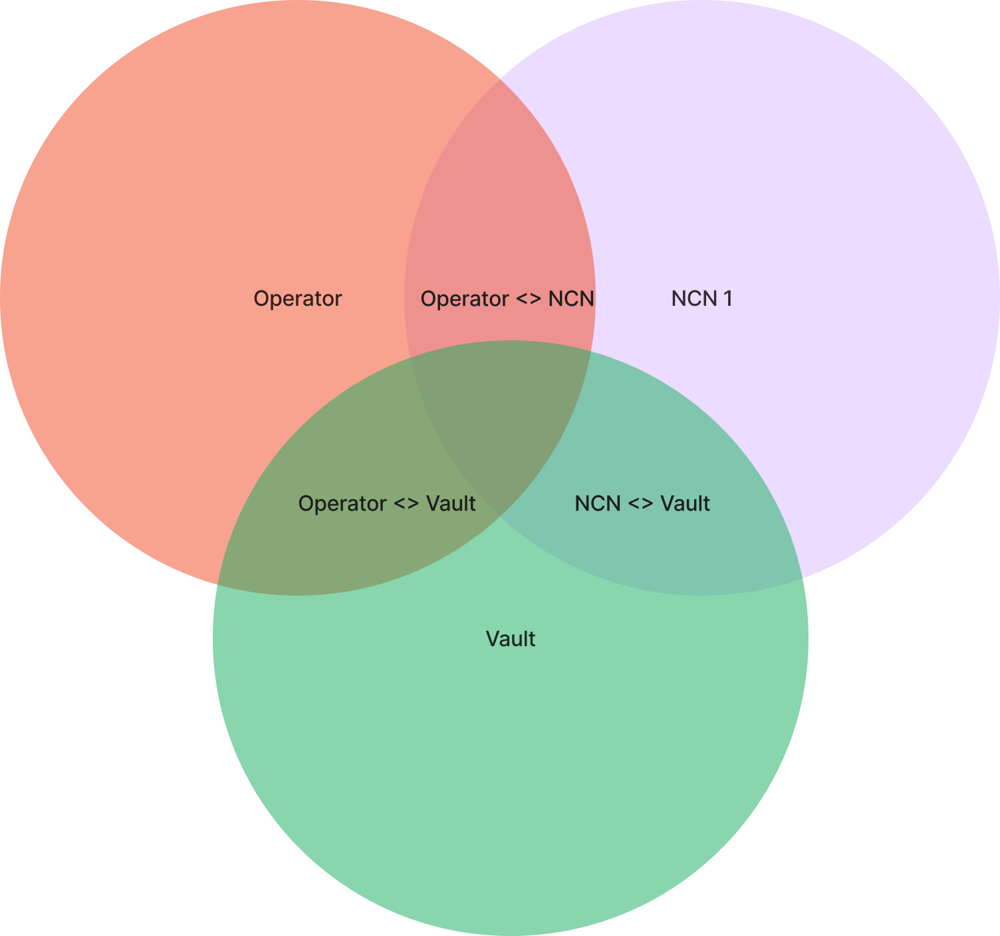

## 1. About the program

The vault program manages the vault receipt tokens (VRTs) and associated deposits. The program stores deposited funds and handles the minting and burning of tokenized stake.

## 2. Relationships

The vault program interacts with other entities in the Jito Restaking protocol:

- Operators: The vault delegates to operators and manages these relationships
- NCN: The vault interacts with NCN for slashing and other protocol-specific operations
- Users: Deposit assets and receive VRTs, or burn VRTs to withdraw assets

Below is a diagram of the relationships between the entities:

### 2.0.1. Vault NCN Ticket

### 2.0.2. Vault Operator Delegation

### 2.0.3. Vault NCN Slasher Ticket

### 2.0.4. Vault NCN Slasher Operator Ticket

## 3. Tracking State

State in these programs is spread out across many accounts.
To reason about the state of stake at any given time, one can reference the chart below.

Assets are considered staked iff:

- The NCN has opted-in to the operator
- The operator has opted-in to the NCN
- The operator has opted-in to the vault
- The vault has opted-in to the operator
- The vault has opted-in to the NCN
- The NCN has opted-in to the vault
- The Vault is delegated to that operator

When assets are staked and the following conditions are met, the vault can be slashed by a given slasher:

- The NCN has opted in to a slasher for the given vault.
- The vault has agreed to the conditions set by the NCN for slashing the vault.

